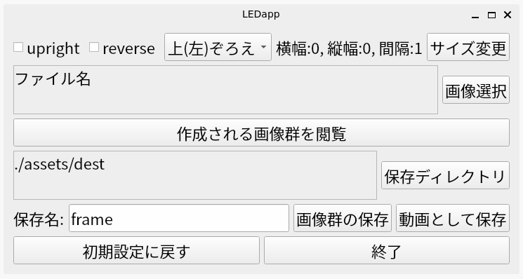

# LEDapp v1.3.0
## 概要
[LED2024](https://github.com/polar-solvent/LED2024)をアプリケーション化したものです。
## インストール方法
※LEDappをインストールする前に、[Noto Sans JP](https://fonts.google.com/noto/specimen/Noto+Sans+JP)のインストールをお願いします。

[python公式ダウンロードページ](https://www.python.org/downloads/)からpythonをダウンロードして、ターミナルに
```sh
git clone https://github.com/polar-solvent/LEDapp2.git
```
と入力し、
```sh
pip install -r requirements.txt
```
```sh
python main.py
```
と順に入力して実行してください。
## 使い方
### 各パーツの説明



この画像は、LEDappを起動した際に表示される画面です。上から各部を順を追って説明します。

1. uprightボックス・reverseボックス
    チェックを入れれば、upright、reverseをTrueにすることができます。uprightは横倒しに、reverseは反対向きに画像をずらすことができます。
2. arrangeプルダウン
    画像を配置する場所について、上(左)ぞろえ、中央ぞろえ、下(右)ぞろえの3つのうちからarrangeの項目を選択することができます。()の外はuprightがFalseのとき、内はuprightがTrueのときのそろえる位置です。
3. サイズ一覧、サイズ変更ボタン
    サイズ変更ボタンを押すと別のウィンドウが開き、縦幅(垂直方向)・横幅(水平方向)・間隔(1回にずらす幅)を入力できます。

    ずらす方向の幅に対して間隔が大きすぎる場合警告が出て間隔をずらす方向の幅と同じ大きさまで減らされるので、再入力をしてください。

    なお、uprightボックスにチェックを付け外しすることによって間隔がずらす方向の幅を超えた場合は、警告が出てもとのuprightに戻ります。
4. ファイル名表示、画像選択ボタン
    画像選択ボタンを押すとファイルを選択するウィンドウが開きます。そこでファイルを選択すると選択したファイルのパスが左側に表示されます。複数ファイルを選択した場合は","区切りで表示されます。

    画像ファイル(cv2で読み込めるもの)以外を選択した場合、警告が出るので再度画像ファイルを選択してください。

    ファイルを選択すると、uprightがFalseの場合横幅は選択した画像の横幅の和に、縦幅は選択した画像の縦幅の最大値になります。uprightがTrueのときは縦横逆です。uprightがTrueでもFalseでも、間隔は1になります。
5. 作成される画像群を閲覧ボタン
    画像を選択した状態で作成される画像群を閲覧ボタンを押すと、作成される画像群を一連の動画として流したものが表示されます。表示時間は約2秒です。

    表示中にqのキーが押された場合、そこで表示が終了されます。表示中にpのキーが押された場合、現在表示されている画像のまま次の写真への移行を一時停止し、再度pのキーが押された場合移行を再開します。
6. 保存ディレクトリ表示、保存ディレクトリボタン
    保存ディレクトリボタンを押すとディレクトリを選択するウィンドウが開きます。そこでディレクトリを選択すると選択したディレクトリのパスが左側に表示されます。デフォルトは`./assets/dest`です。
7. 保存名入力
    画像群や動画を保存する名前を入力します。画像群の保存の際は`xxx_(0以上の数字).bmp`の`xxx`の部分を入力してください。動画の保存の際は`xxx.mp4`または`xxx.gif`と入力してください。

    ※動画の保存には、最後に拡張子`mp4`または`gif`の入力が必要ですが、画像群の保存の際に拡張子が入っていると警告が出され保存できません。入力の際は注意してください。動画の保存で`mp4`と`gif`以外の拡張子には対応していません。
8. 画像群の保存ボタン・動画として保存ボタン
    画像群の保存ボタンを押すと1コマ1コマがbmp形式の画像ファイルとして保存され、動画として保存ボタンを押すと一連のコマをそのまま流した動画が指定した形式の動画ファイルとして保存されます。

    動画として保存ボタンを押した場合、別のウィンドウが開いて1秒あたりに写す画像数、あるいは全体の動画の時間を選ぶことができます。ラジオボタンをクリックして選択してください。1秒あたりに写す画像数が大きすぎるあるいは小さすぎる場合は、警告が出されるので注意してください。

    画像群、及び動画の保存の直前にはサンプル映像が映されます。サンプル映像の表示中にqのキーが押された場合、そこで表示が終了され、保存が実行されます。表示中にpのキーが押された場合、現在表示されている画像のまま次の写真への移行を一時停止し、再度pのキーが押された場合移行を再開します。

    保存が終了したときにはお知らせします。
9. 初期設定に戻すボタン
    初期設定に戻すボタンを押すと、選択したボタンやファイルが全て最初に開いたときのものに戻ります。一度押すとウィンドウを閉じるかどうかの確認画面が出るので、初期設定に戻したい場合はYesを選択し、戻したくない場合はNoを選択してください。
10. 終了ボタン
    終了ボタンを押すと、いま開いているウィンドウを閉じ、プログラムを終了することができます。一度押すとウィンドウを閉じるかどうかの確認画面が出るので、終了したい場合はYesを選択し、終了したくない場合はNoを選択してください。

    右上の×ボタンを押しても終了することができます。

